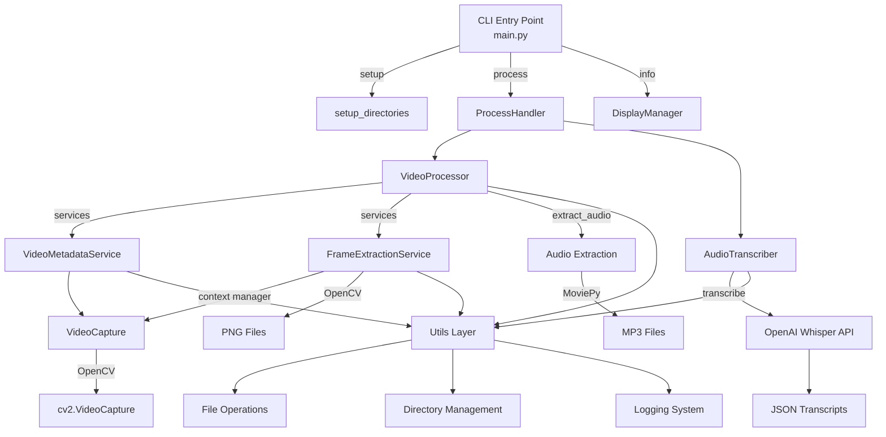

# 🎬 Sniffer - Video Processing and Transcription Tool

A comprehensive Python tool for processing video files to extract audio, frames, and generate transcriptions with precise word-level timestamps using OpenAI's Whisper API.

## ✨ Features

- **🎵 Audio Extraction**: Extract high-quality audio from MP4 videos
- **🖼️ Frame Extraction**:
  - Extract all frames with millisecond timestamps
  - Extract frames at specific positions per second (start, middle, end, random)
- **🎙️ AI Transcription**: Generate transcriptions with word-level timestamps using OpenAI Whisper
- **⏱️ Second-Aligned Words**: Map words to exact seconds for perfect frame-transcript synchronization
- **📁 Batch Processing**: Process single videos or entire directories
- **🔄 Advanced Frame-Audio Sync**: Align transcript words with extracted frames with speech coverage analysis
- **🎨 Beautiful CLI**: Rich terminal interface with progress tracking and tables
- **🧪 Comprehensive Testing**: Full test suite with pytest
- **📊 Structured Logging**: Professional logging system

## 🚀 Quick Start

### System Requirements

SunDogs requires **FFmpeg** for video processing. Install it first:

**macOS (with Homebrew):**
```bash
brew install ffmpeg
```

**Ubuntu/Debian:**
```bash
sudo apt update
sudo apt install ffmpeg
```

**Windows:**
- Download from [FFmpeg official website](https://ffmpeg.org/download.html)
- Or use [Chocolatey](https://chocolatey.org/): `choco install ffmpeg`

**Verify installation:**
```bash
ffmpeg -version
```

### Installation

```bash
cd sniffer

# Install with uv (recommended)
uv sync
```

### Environment Setup

Create a `.env` file in the project root for configuration:

```bash
# Copy the example file
cp .env.example .env

# Edit the .env file with your settings
# At minimum, set your OpenAI API key for transcription features
OPENAI_API_KEY=your-api-key-here
```

The `.env` file supports the following configuration options:

**Required:**
- `OPENAI_API_KEY` - Your OpenAI API key for transcription features

**Optional (Logging):**
- `LOG_LEVEL` - Logging level (DEBUG, INFO, WARNING, ERROR) [default: INFO]
- `LOG_FILE` - Path to log file [default: logs/sniffer.log]
- `LOG_ROTATION` - Log rotation setting [default: 10 MB]
- `LOG_RETENTION` - Log retention period [default: 10 days]
- `LOG_COLORIZE` - Enable colored console output [default: true]

### Basic Usage

```bash
# Setup directories and check dependencies
sniffer setup

# Process a single video with transcription
sniffer process video.mp4 --frames middle --transcribe

# Batch process a folder of videos
sniffer process ./videos --frames random

# Get information about videos without processing
sniffer info ./videos
```

## 📖 CLI Commands

### `process` - Main Processing Command

Process video files to extract audio, frames, and generate transcriptions.

```bash
sniffer process INPUT_PATH [OPTIONS]
```

**Options:**
- `--audio/--no-audio`: Extract audio (default: enabled)
- `--frames [start|middle|end|random]`: Extract frames by position per second
- `--all-frames`: Extract ALL frames (⚠️ large output!)
- `--transcribe`: Transcribe audio with word-level timestamps
- `--verbose, -v`: Verbose output with detailed configuration

**Examples:**
```bash
# Process with middle frames and transcription
sniffer process video.mp4 --frames middle --transcribe

# Batch process folder with audio only
sniffer process ./videos

# Extract all frames without audio
sniffer process video.mp4 --all-frames --no-audio
```

### `info` - Video Information

Show information about video files without processing them.

```bash
sniffer info INPUT_PATH
```

### `setup` - Environment Setup

Setup required directories and check dependencies.

```bash
sniffer setup
```

## 🐍 Python API

Use Sniffer programmatically in your Python applications:

### Core Video Processing

```python
from sniffer import VideoProcessor, AudioTranscriber
from pathlib import Path

# Initialize processor for single video
processor = VideoProcessor("path/to/video.mp4")

# Extract audio and frames
audio_path = processor.extract_audio()
frames = processor.extract_frames_by_position("middle")
metadata = processor.get_video_metadata()

# Complete processing pipeline
results = processor.process_all(
    extract_audio=True,
    extract_all_frames=False,
    frame_position="middle"
)
```

### 🆕 Second-Aligned Transcription

Perfect synchronization between frames and transcript words:

```python
from sniffer import AudioTranscriber

# Transcribe with enhanced word-level timestamps
transcriber = AudioTranscriber("audio.mp3")
transcript = transcriber.transcribe()

# 🎯 NEW: Get words with second mapping
enhanced_words = transcriber.extract_word_timestamps(transcript)
# Each word includes: word, start, end, seconds_spoken
# Example: {"word": "hello", "start": 0.0, "end": 0.5, "seconds_spoken": [0]}

# 🎯 NEW: Get words organized by second
words_by_second = transcriber.extract_words_by_second(transcript)
# Returns: {0: [words in second 0], 1: [words in second 1], ...}

# 🎯 NEW: Quick lookup for specific second
words_at_second_5 = transcriber.get_words_for_second(transcript, 5)
# Returns all words spoken during second 5

# 🎯 NEW: Advanced frame-transcript synchronization
frame_seconds = [0, 1, 2, 3, 4, 5]  # Seconds where you extracted frames
sync_data = transcriber.synchronize_transcript_with_frames(transcript, frame_seconds)

# Analyze each frame's speech content
for second, data in sync_data.items():
    if data["has_speech"]:
        primary_words = ", ".join(data["primary_words"])
        coverage = data["speech_coverage"] * 100
        print(f"Frame {second}s: '{primary_words}' ({coverage:.0f}% speech)")
    else:
        print(f"Frame {second}s: (silence)")
```

### Service Layer Usage (Advanced)

For fine-grained control over processing:

```python
from sniffer.services import VideoMetadataService, FrameExtractionService
from sniffer.services.frame_extraction import FrameExtractionConfig
from pathlib import Path

# Direct service usage
video_path = Path("video.mp4")

# Extract metadata with dedicated service
metadata_service = VideoMetadataService()
metadata = metadata_service.extract_metadata(video_path)

# Configure frame extraction precisely
frame_service = FrameExtractionService()
config = FrameExtractionConfig(
    video_path=video_path,
    position="random",
    output_dir="custom/frames/"
)
frames = frame_service.extract_frames_by_position(config)
```

### Complete Workflow Example

```python
from pathlib import Path
from sniffer import VideoProcessor, AudioTranscriber

# 1. Process video
video_file = Path("presentation.mp4")
processor = VideoProcessor(video_file)
results = processor.process_all(
    extract_audio=True,
    frame_position="middle"  # Extract middle frame of each second
)

# 2. Transcribe with second-aligned mapping
if results.get("audio_path"):
    transcriber = AudioTranscriber(results["audio_path"])
    transcript = transcriber.transcribe()

    # 3. Get frame seconds from processing results
    frame_seconds = list(results.get("position_frames", {}).keys())

    # 4. Synchronize transcript with extracted frames
    sync_data = transcriber.synchronize_transcript_with_frames(
        transcript, frame_seconds
    )

    # 5. Analyze synchronized content
    for second in frame_seconds:
        frame_path = results["position_frames"][second]
        words_data = sync_data[second]

        if words_data["has_speech"]:
            words = ", ".join(words_data["primary_words"])
            print(f"📸 Frame: {Path(frame_path).name}")
            print(f"💬 Speech: '{words}' ({words_data['word_count']} words)")
            print(f"📊 Coverage: {words_data['speech_coverage']*100:.0f}%")
        else:
            print(f"📸 Frame: {Path(frame_path).name} (visual only)")
        print()
```

## 🗺️ Architecture & Call Flow

### System Overview



### Core Component Flow

#### 1. CLI Entry Points (`main.py`)

```python
# Command flow
app.command("process") → process() → {
    ProcessHandler() → {
        VideoProcessor(input_path) → {
            VideoMetadataService() → metadata extraction
            FrameExtractionService() → frame processing
            ├── extract_audio() → list[str]
            ├── extract_frames_by_position() → dict[int, str]
            └── extract_all_frames() → list[str]
        }

        AudioTranscriber() → {
            ├── transcribe() → dict
            └── synchronize_with_frames() → list[dict]
        }
    }

    DisplayManager() → {
        ├── show_processing_config()
        ├── show_results_summary()
        └── show_video_info_table()
    }
}
```

#### 2. VideoProcessor Class (`video_processor.py`)

```python
VideoProcessor(video_file) → {
    __init__() → {
        ├── VideoMetadataService() → metadata operations
        ├── FrameExtractionService() → frame operations
        ├── ensure_directory() → utils.directory
        └── get_logger() → utils.logging
    }

    # Public Methods
    ├── extract_audio() → _extract_single_audio() → MoviePy
    ├── extract_all_frames() → FrameExtractionService.extract_all_frames()
    ├── extract_frames_by_position() → FrameExtractionService.extract_frames_by_position()
    ├── get_video_metadata() → VideoMetadataService.extract_metadata()
    └── process_all() → Orchestrates all operations
}
```

#### 3. AudioTranscriber Class (`transcription.py`)

```python
AudioTranscriber(api_key) → {
    __init__() → OpenAI(api_key)

    # Core Methods
    ├── transcribe_with_timestamps() → OpenAI.audio.transcriptions.create()
    ├── transcribe_batch() → {
    │   ├── transcribe_with_timestamps() (per file)
    │   └── save_transcripts → JSON files
    │   }

    # Analysis Methods
    ├── extract_word_timestamps() → list[dict]
    ├── extract_segments() → list[dict]
    ├── get_text_at_timestamp() → str | None
    └── synchronize_with_frames() → list[dict]
}
```

#### 4. Service Layer

```python
services/ → {
    video_metadata.py → {
        VideoMetadataService() → {
            ├── extract_metadata() → VideoMetadata | dict
            ├── _extract_opencv_metadata() → dict
            ├── _extract_moviepy_metadata() → dict
            └── get_basic_info() → tuple[float, int, float]
        }
    }

    frame_extraction.py → {
        FrameExtractionService() → {
            ├── extract_all_frames() → list[str]
            ├── extract_frames_by_position() → dict[int, str]
            ├── _get_video_info() → tuple[float, int, float]
            ├── _calculate_timestamps_per_second() → list[tuple[int, int]]
            └── _fetch_frames_by_timestamp() → dict[int, str]
        }

        FrameExtractionConfig() → {
            ├── video_path: Path
            ├── position: Optional[str]
            ├── extract_all: bool
            └── output_dir: Optional[str]
        }
    }

    video_capture.py → {
        VideoCapture(video_path) → {
            ├── __enter__() → cv2.VideoCapture
            ├── __exit__() → resource cleanup
            └── is_opened → bool property
        }
    }
}
```

#### 5. CLI Layer

```python
cli/ → {
    process_handler.py → {
        ProcessHandler() → {
            ├── process_videos() → tuple[list[ProcessResults], dict]
            ├── _process_video_files() → list[ProcessResults]
            └── _process_transcriptions() → dict
        }
    }

    display.py → {
        DisplayManager() → {
            ├── show_processing_config() → None
            ├── show_results_summary() → None
            ├── show_video_info_table() → None
            ├── show_setup_status() → None
            ├── print() → console.print wrapper
            └── print_exception() → console.print_exception wrapper
        }
    }
}
```

#### 6. Utils Layer

```python
utils/ → {
    file.py → {
        ├── extract_filename_from_path()
        ├── is_video_file() / is_audio_file()
        ├── get_file_size() / format_file_size()
        └── ensure_file_exists()
    }

    directory.py → {
        ├── ensure_directory() / ensure_directories()
        ├── is_directory_empty()
        ├── list_files_in_directory()
        └── clean_directory()
    }

    logging.py → {
        ├── setup_default_logging()
        ├── get_logger() → Loguru instance
        └── ProgressLogger → {
            ├── start_operation()
            ├── progress_update()
            ├── complete_operation()
            └── operation_error()
        }
    }
}
```

### Data Flow Examples

#### Complete Processing Pipeline

```python
# CLI Command: uv run sniffer process video.mp4 --frames middle --transcribe

main.process() → {
    1. VideoProcessor("video.mp4") → {
        ├── _get_video_files() → [Path("video.mp4")]
        └── setup directories
    }

    2. processor.process_all() → {
        ├── extract_audio() → ["data/audio/video.mp3"]
        └── extract_frames_by_position("middle") → {
            "video.mp4": {0: "frame_s0_500ms.png", 1: "frame_s1_1500ms.png"}
        }
    }

    3. AudioTranscriber() → {
        ├── transcribe_batch(["data/audio/video.mp3"]) → {
        │   "video.mp3": {
        │       "text": "transcript...",
        │       "words": [{"word": "hello", "start": 0.0, "end": 0.5}]
        │   }
        │   }
        └── save transcripts → "data/transcripts/video_transcript.json"
    }

    4. show_results_summary() → Rich table display
}
```

#### Batch Processing Flow

```python
# CLI Command: uv run sniffer process ./videos --frames random

VideoProcessor("./videos") → {
    _get_video_files() → [
        Path("videos/video1.mp4"),
        Path("videos/video2.mp4"),
        Path("videos/video3.mp4")
    ]

    process_all() → {
        # Parallel processing for each video
        for video_file in video_files:
            ├── _extract_single_audio(video_file)
            └── _extract_frames_by_position_single(video_file, "random")
    }
}
```

### External Dependencies Integration

```python
# System Integration Points
{
    "FFmpeg": "Required by MoviePy for video processing",
    "OpenCV": "Direct integration for frame extraction",
    "OpenAI API": "Whisper model for transcription",
    "File System": "utils.directory & utils.file for I/O operations"
}
```

## 📁 Output Structure

SunDogs organizes output files in a clean directory structure:

```
data/
├── audio/                  # Extracted audio files (.mp3)
├── video_frames/          # Extracted frames (.png)
│   └── video_name/        # Frames grouped by video
├── transcripts/           # Transcription files (.json)
└── video/                 # Original video files
```

### Frame Naming Convention

- **All frames**: `frame_ts_00001234.png` (timestamp in milliseconds)
- **Position frames**: `frame_s2_1500ms.png` (second 2, at 1500ms)

### Transcript Format

**Original OpenAI Whisper Format:**
```json
{
  "text": "Full transcript text",
  "words": [
    {
      "word": "Hello",
      "start": 0.0,
      "end": 0.5
    }
  ],
  "segments": [
    {
      "text": "Hello world",
      "start": 0.0,
      "end": 1.0,
      "words": [...]
    }
  ]
}
```

**🆕 Enhanced Second-Aligned Format:**

*Words with second mapping:*
```json
{
  "word": "Hello",
  "start": 0.0,
  "end": 0.5,
  "seconds_spoken": [0]
}
```

*Words organized by second:*
```json
{
  "0": [
    {"word": "Hello", "start": 0.0, "end": 0.5, "duration_in_second": 0.5}
  ],
  "1": [
    {"word": "world", "start": 0.6, "end": 1.2, "duration_in_second": 0.4}
  ]
}
```

*Frame synchronization data:*
```json
{
  "0": {
    "second": 0,
    "words": [...],
    "word_count": 2,
    "speech_coverage": 0.9,
    "primary_words": ["Hello", "world"],
    "has_speech": true
  }
}
```

## ⚙️ Configuration

### Environment Variables

- `OPENAI_API_KEY`: Your OpenAI API key for transcription features

### Video Support

Currently supports **MP4 files only**. Additional formats can be added by extending the `VideoProcessor` class.

### Frame Positions

- **start**: First frame of each second
- **middle**: Middle frame of each second
- **end**: Last frame of each second
- **random**: Random frame within each second

## 🧪 Development

### Running Tests

```bash
# Run all tests
uv run pytest

# Run with coverage
uv run pytest --cov=sniffer

# Run specific test file
uv run pytest tests/test_video_processor.py -v
```

### Code Quality

```bash
# Format code
uv run ruff format .

# Lint code
uv run ruff check .

# Type checking
uv run mypy sniffer/

# Full CI pipeline
make ci
```

### Project Structure

```
sniffer/
├── __init__.py                 # Package exports
├── main.py                     # CLI entry point
├── video_processor.py          # Video processing orchestrator
├── transcription.py            # Audio transcription
├── cli/                        # CLI layer
│   ├── __init__.py            # CLI package exports
│   ├── process_handler.py     # Video processing workflow
│   └── display.py             # Rich console output management
├── services/                   # Service layer
│   ├── __init__.py            # Services package exports
│   ├── video_metadata.py      # Video metadata extraction
│   ├── frame_extraction.py    # Frame extraction operations
│   └── video_capture.py       # Resource-managed video capture
├── config/                     # Configuration
│   ├── __init__.py            # Config package exports
│   └── constants.py           # Application constants
└── utils/                      # Utility functions
    ├── __init__.py            # Utils package exports
    ├── file.py                # File operations
    ├── directory.py           # Directory management
    └── logging.py             # Logging system
```

## 🔧 Requirements

### System Dependencies
- **FFmpeg**: Required for video processing (see installation instructions above)

### Python Dependencies
- **Python**: 3.13+ (uses modern syntax features)
- **OpenCV**: Video and image processing
- **MoviePy**: Video file manipulation (requires FFmpeg)
- **OpenAI**: Whisper API for transcription
- **Loguru**: Modern logging library
- **python-dotenv**: Environment variable management
- **Typer + Rich**: Beautiful CLI interface

## 🚀 Real-World Use Cases

### 📚 Educational Content Analysis

Perfect for analyzing educational videos, lectures, and tutorials:

```python
from sniffer import VideoProcessor, AudioTranscriber

# Process educational video
processor = VideoProcessor("lecture.mp4")
results = processor.process_all(extract_audio=True, frame_position="middle")

# Get second-by-second analysis
transcriber = AudioTranscriber(results["audio_path"])
transcript = transcriber.transcribe()
frame_seconds = list(results["position_frames"].keys())

# Sync transcript with visual content
sync_data = transcriber.synchronize_transcript_with_frames(transcript, frame_seconds)

# Identify key educational moments
key_moments = []
for second, data in sync_data.items():
    if data["speech_coverage"] > 0.7:  # High speech activity
        keywords = data["primary_words"]
        if any(word in ["important", "key", "remember", "note"] for word in keywords):
            key_moments.append({
                "second": second,
                "frame": results["position_frames"][second],
                "keywords": keywords,
                "importance": "high"
            })

print(f"Found {len(key_moments)} key educational moments!")
```

### 🎬 Video Content Indexing

Create searchable video indexes with frame-accurate word positioning:

```python
# Build searchable index
def create_video_index(video_path):
    processor = VideoProcessor(video_path)
    results = processor.process_all(extract_audio=True, frame_position="start")

    transcriber = AudioTranscriber(results["audio_path"])
    transcript = transcriber.transcribe()

    # Create searchable word index with exact frame references
    word_index = {}
    words_by_second = transcriber.extract_words_by_second(transcript)

    for second, words in words_by_second.items():
        for word_data in words:
            word = word_data["word"].lower()
            if word not in word_index:
                word_index[word] = []

            word_index[word].append({
                "second": second,
                "frame_path": results["position_frames"].get(second),
                "confidence": word_data["duration_in_second"],
                "context": [w["word"] for w in words]
            })

    return word_index

# Usage
index = create_video_index("presentation.mp4")
search_results = index.get("algorithm", [])  # Find all mentions of "algorithm"
```

### 🎭 Content Moderation & Analysis

Automatically detect and flag content based on speech-visual correlation:

```python
def analyze_content_safety(video_path, flagged_terms):
    processor = VideoProcessor(video_path)
    results = processor.process_all(extract_audio=True, frame_position="random")

    transcriber = AudioTranscriber(results["audio_path"])
    transcript = transcriber.transcribe()

    # Check each second for flagged content
    alerts = []
    for second in range(int(transcript.get("words", [])[-1].get("end", 0)) + 1):
        words_data = transcriber.get_words_for_second(transcript, second)
        spoken_words = [w["word"].lower() for w in words_data]

        # Check for flagged terms
        for term in flagged_terms:
            if term.lower() in " ".join(spoken_words):
                alerts.append({
                    "second": second,
                    "term": term,
                    "context": spoken_words,
                    "frame": results["position_frames"].get(second),
                    "severity": "high" if any("explicit" in w for w in spoken_words) else "medium"
                })

    return alerts
```

## 📄 License

This project is licensed under the MIT License - see the LICENSE file for details.

## 🤝 Contributing

1. Fork the repository
2. Create a feature branch (`git checkout -b feature/amazing-feature`)
3. Commit your changes (`git commit -m 'Add amazing feature'`)
4. Push to the branch (`git push origin feature/amazing-feature`)
5. Open a Pull Request

## 🐛 Troubleshooting

### Common Issues

**"No module named 'ffmpeg'" or video processing errors**
- Install FFmpeg system-wide (see System Requirements section)
- Verify FFmpeg is in your PATH: `ffmpeg -version`
- Restart your terminal after installation

**"No MP4 files found"**
- Ensure your video files have the `.mp4` extension
- Check that the directory path is correct

**"OpenAI API key is required"**
- Create a `.env` file and set `OPENAI_API_KEY=your-key-here`
- Or set the environment variable: `export OPENAI_API_KEY='your-key'`
- Verify your API key is valid and has credits

**"Could not open video file"**
- Verify the video file is not corrupted
- Ensure FFmpeg is properly installed
- Check that OpenCV can read the video format

### Getting Help

- Check the [Issues](https://github.com/erictt/sniffer/issues) page
- Create a new issue with detailed information about your problem
- Include log files when reporting bugs (use `--verbose` flag)

---

Made with ❤️ for video processing and AI transcription
